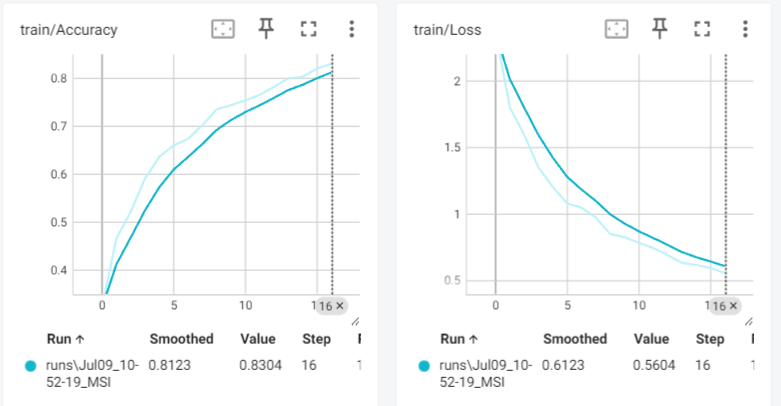
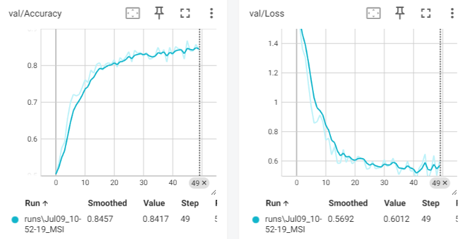
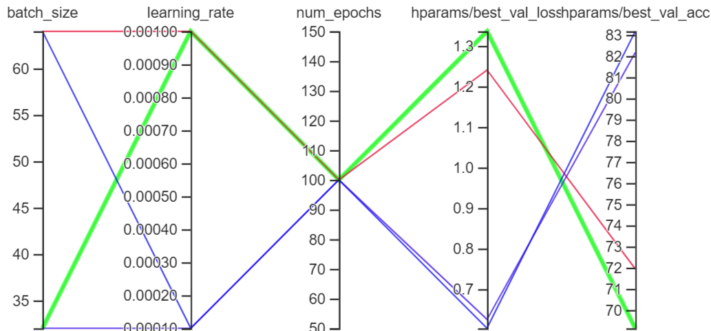
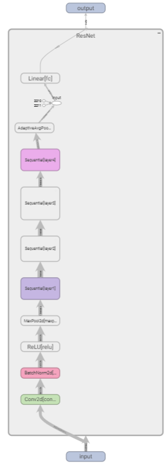

# Relazione Laboratorio di Ottimizzazione, Intelligenza Artificiale e Machine Learning: Progetto di Classificazione delle Immagini del Dataset OxfordIIITPet

## Table of Contents
- [Relazione Laboratorio di Ottimizzazione, Intelligenza Artificiale e Machine Learning: Progetto di Classificazione delle Immagini del Dataset OxfordIIITPet](#relazione-laboratorio-di-ottimizzazione-intelligenza-artificiale-e-machine-learning-progetto-di-classificazione-delle-immagini-del-dataset-oxfordiiitpet)
  - [Table of Contents](#table-of-contents)
  - [Obiettivo](#obiettivo)
  - [Esperimenti](#esperimenti)
    - [Configurazione del Dataset](#configurazione-del-dataset)
    - [Architettura del Modello](#architettura-del-modello)
    - [Training del Modello](#training-del-modello)
    - [Testing e Valutazione](#testing-e-valutazione)
    - [Visualizzazione con TensorBoard](#visualizzazione-con-tensorboard)
  - [Problematiche Riscontrate](#problematiche-riscontrate)
    - [Preparazione del Dataset](#preparazione-del-dataset)
    - [Configurazione dei Modelli](#configurazione-dei-modelli)
    - [Performance del Training](#performance-del-training)
    - [Automazione degli esperimenti](#automazione-degli-esperimenti)
  - [Punti Critici](#punti-critici)
  - [Risultato Atteso](#risultato-atteso)
  - [Risultati Ottenuti](#risultati-ottenuti)
  - [Grafici e Visualizzazioni](#grafici-e-visualizzazioni)
    - [1. Training Loss e Accuracy](#1-training-loss-e-accuracy)
    - [2. Validation Loss e Accuracy](#2-validation-loss-e-accuracy)
  - [Esperimenti](#esperimenti-1)
  - [Visualizzazione degli Embeddings](#visualizzazione-degli-embeddings)
  - [Considerazioni Finali](#considerazioni-finali)
    - [Grafico dei vari layer del progetto:](#grafico-dei-vari-layer-del-progetto)

## Obiettivo
L'obiettivo principale di questo progetto è sviluppare un'applicazione che permetta di addestrare un modello di rete neurale convoluzionale (CNN) per la classificazione delle immagini di cani e gatti del dataset OxfordIIITPet. L'applicazione offre un'interfaccia grafica che consenta agli utenti di selezionare le classi di animali da addestrare e testare, visualizzare i progressi e i risultati del training, e utilizzare TensorBoard per esplorare gli embeddings.
Le classi sono suddivise in più file e ciascuna di queste ha un compito ben preciso per garantire la modularità del codice:
- app_init.py: responsabile dell'inizializzazione dell'applicazione. Configura e avvia la interfaccia grafica facendo uso di Tkinter. Utilizza parametri di configurazione presi dal file config.json e integra diverse funzionalità:
  - setup della UI: fa uso delle funzionalità di Tkinter come Frame, Widget Text, TopLevel Widget
  - gestione delle fasi di training, testing e experiment: tutti e tre possono essere iniziati, il training in più può essere stoppato e ripreso 
  - uso di log
- DataLoaderHelper.py: offre funzionalità e funzioni di supporto per caricare il dataset Oxford IIIT Pet dataset e su questo effettuare le seguenti operazioni:

  - filtraggio: prendere il dataset originale e filtrarlo sulle classi scelte dall'utente
  - dividere (esclusivo per la fase di training): prendere il dataset filtrato e dividerlo con un rapporto di 8 a 2. Ossia l'80% sarà il dataset di training e il 20% sarà il dataset di validation
  - trasformare: applicare le trasformazioni adeguate al dataset creato (train o val)

  Si presta attenzione a rimappare le label ai nuovi indici delle classi affincè il seguente controllo non fallisca: Assertion t >= 0 && t < n_classes
- training_manager.py: gestisce le procedure di training, testing e experiment. È strettamente legato ad app_init in quanto le scelte fatte dall'utente portano ai corrispondenti metodi di questo file. Coordina le varie fasi come il caricamento dei dati, l'allenamento, il testing ed experiment del modello, il salvataggio dei checkpoint, e altre operazioni necessarie per l'esecuzione completa del ciclo della procedura scelta. Inoltre incapsula le operazioni in thread per mantenere la app responsive.
- trainer.py: questo file contiene la logica di allenamento del modello. Include funzioni per il ciclo di training e validation, nonchè per fermare l'addestramento e riprenderlo successivamente (funzionalità gestita dal bottone stop_training). Si avvale della classe EarlyStopper per interrompere il ciclo di addestramento
- EarlyStopper.py: l'obiettivo principale di questo file è di interrompere l'addestramento del modello anticipatamente per prevenire il sovraadattamento (overfitting) e per risparmiare risorse computazionali. I valori utili, min_delta e patience, sono configurati tramite il file config.json.
- experiment.py: contiene la logica per la gestione e l'esecuzione di esperimenti. Include funzioni per configurare, lanciare e monitorare esperimenti con diverse impostazioni di iperparametri, batch size, e altre variabili sperimentali.
- model_factory.py: fornisce una factory per la creazione di modelli. Include funzioni per costruire e restituire modelli di rete neurale semplificando il processo di inizializzazione dei modelli durante gli esperimenti. È possibile creare due modelli: ResNet e AlexNet. Ad entrambi si sostituisce l'ultimo layer passandogli il numero di classi scelte dall'utente. 
- tester.py: responsabile della logica di testing del modello. Include funzioni per valutare le prestazioni del modello su un set di test, calcolare metriche di performance e generare report di valutazione.

## Esperimenti

### Configurazione del Dataset
- Il dataset OxfordIIITPet è stato utilizzato per l'addestramento e il testing del modello. Questo dataset include immagini di varie razze di cani e gatti, con annotazioni delle razze.
- Le immagini sono state suddivise in set di training, validation e testing.

### Architettura del Modello
- È stato utilizzato i modelli ResNet50 e AlexNet pre-addestrati per beneficiare del trasferimento di apprendimento.
- Il modello è stato adattato per classificare il numero di classi selezionate dall'utente.

### Training del Modello
- Il training è stato effettuato utilizzando gli ottimizzatori Adam con un learning rate iniziale di 0.0001 e SGD con una learning rate iniziale di 0.001.
- Il modello è stato addestrato per un numero fisso di epoche, con monitoraggio delle metriche di accuratezza e perdita.
- E' stato implementato l'Early stopping in modo tale che la fase di addestramento possa essere fermata.
- Attraverso il bottone Stop invece è possibile salvare un checkpoint della fase di trainning e riprendere l'esecuzione del trainning con un load del file di checkpoint.

### Testing e Valutazione
- Dopo il training, il modello è stato testato su un set di immagini non viste.
- Sono state generate metriche di valutazione come il classification report, la matrice di confusione, F1 score, recall e precision. 
- Infine viene fatta una stampa con 4 immagine con la label sopra che indica in rosso il nome dell'animale se è sbagliato e in verde se è giusto.

### Visualizzazione con TensorBoard
- Gli embeddings sono stati registrati e visualizzati utilizzando TensorBoard per esplorare la rappresentazione del modello.

## Problematiche Riscontrate

### Preparazione del Dataset
- La suddivisione del dataset in set di training e testing è stata una fase critica per garantire la validità dei risultati.

### Configurazione dei Modelli
- L'adattamento dei modelli ResNet50 e AlexNet per il numero variabile di classi è stato un passaggio importante.
- La scelta dei parametri di training, come la learning rate e il numero di epoche, ha richiesto diversi tentativi per ottenere risultati ottimali.

### Performance del Training
- La gestione delle risorse computazionali, in particolare l'uso della GPU, è stata essenziale per ridurre i tempi di addestramento.
- Il monitoraggio e la visualizzazione dei progressi del training tramite TensorBoard sono stati fondamentali per identificare problemi di overfitting o underfitting.

### Automazione degli esperimenti
- E' stato difficile scegliere i parametri giusti per fare esperimenti rilevanti come per esempio il numero di epoche, il numero di batch e il learning rate.

## Punti Critici
- **Tempo di Addestramento**: L'addestramento del modello ha richiesto un tempo significativo, specialmente con dataset di grandi dimensioni.
- **Gestione della Memoria**: L'utilizzo della GPU ha migliorato le performance, ma ha richiesto attenzione nella gestione della memoria per evitare out-of-memory errors.
- **Registrazione degli Embeddings**: La registrazione e la visualizzazione degli embeddings hanno richiesto un'attenta configurazione di TensorBoard.

## Risultato Atteso
L'obiettivo era ottenere un modello di classificazione accurato, in grado di distinguere tra diverse razze di cani e gatti con un'alta precisione. La visualizzazione degli embeddings tramite TensorBoard doveva fornire un insight aggiuntivo sulla rappresentazione appresa dal modello.

## Risultati Ottenuti
- Il modello ha raggiunto una buona accuratezza di classificazione (88%), con metriche di valutazione soddisfacenti.
- La visualizzazione degli embeddings su TensorBoard ha mostrato che il modello ha effettivamente appreso rappresentazioni utili per distinguere tra le diverse classi.

## Grafici e Visualizzazioni

### 1. Training Loss e Accuracy

    

 

### 2. Validation Loss e Accuracy

    

 

## Esperimenti

Cliccando il tasto "Run Experiments" è possibile avviare una serie di esperimenti che testano diverse configurazioni del modello di rete neurale. Durante questi esperimenti, vengono variati parametri come il numero di epoche, il learning rate, la dimensione del batch e la dimensione del dataset. I risultati, inclusi la loss e l'accuratezza, vengono registrati e visualizzati utilizzando TensorBoard. Questo processo aiuta a identificare la configurazione ottimale degli iperparametri per massimizzare le prestazioni del modello.

    

 

## Visualizzazione degli Embeddings

L'utilizzo di TensorBoard per visualizzare gli embeddings fornisce un insight visivo su come il modello rappresenta le diverse classi. Gli embeddings proiettati in uno spazio a bassa dimensione (usando tecniche come PCA o t-SNE) possono mostrare cluster distinti per ciascuna classe.

## Considerazioni Finali

Purtroppo non siamo riusciti ad arrivare alla perfezione del 100% di accuratezza, però esperimentando sul numero di epoche, la dimensione del batch e altri iperparametri stiamo riuscendo a trovare la configurazione ottimale. Inoltre potrebbero portare a un miglioramento significativo l'utilizzo di tecniche di data augmentation per arricchire il dataset e rendere il modello più robusto.

### Grafico dei vari layer del progetto:

    

 